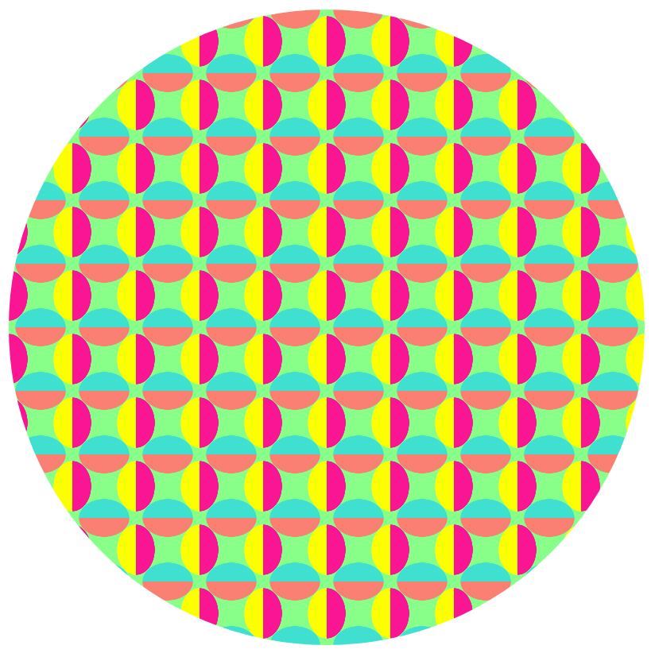

# GRAPHIC PATTERN

A beautiful, colorful and repeating pattern created with CSS radial gradients

## Screenshot

## Built With

- HTML
- CSS  ​

## Live Demo

​
[Live Demo Link]()
​

## Getting Started

​
**Clone the repo on your system, find the index.html file and open with your browser**
​

## Author
​
#### 👤 **Hubert MUGABO**
​
- Github: [@mugberto](https://github.com/mugberto)
- Twitter: [@mugberto](https://twitter.com/mugberto)
- Linkedin: [mugberto](https://www.linkedin.com/in/hubert-mugabo-23144b6a/)

 ​
## Contributing

Contributions, issues and feature requests are welcome!
​
Feel free to check the [issues page](https://github.com/mugberto/graphic-pattern/issues).
​

## Show your support

Please, give a ⭐️ if you like this project!
​
  ​
## License
​
This project is [MIT](lic.url) licensed.